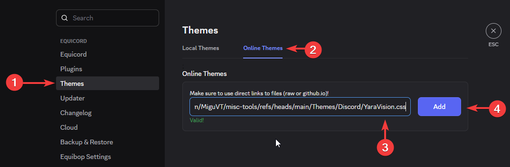

# ClearVision Discord Theme

This is a custom theme for Discord that enhances the user interface and provides a unique look and feel, based on [ClearVision](https://clearvision.gitlab.io/).

## Installation

Can be found in the [Original ClearVision Repository README](https://github.com/ClearVision/ClearVision-v7?tab=readme-ov-file#installing), just instead of using the original theme file, use [This One](./YaraVision.css).

```url
https://raw.githubusercontent.com/MiguVT/misc-tools/refs/heads/main/Themes/Discord/YaraVision.css
```



I recommend using [Vesktop](https://github.com/Vencord/Vesktop) or if need extra features [Equibop](https://github.com/Equicord/Equibop) (Equibop is the same as Vesktop but with extra features, could have stability issues but by my experience stability is the same and with enhancements, also a recent update rewrited the codebase making it easier to follow upstream changes).

## Features

- Improved color scheme
- [Teto background](https://wallpapercave.com/wp/wp9555537.jpg) (One of my favorites Vocaloid characters) - Optimized using webp format for better performance
- [Outlined discord logo](https://www.svgrepo.com/svg/447163/discord-outline) in the top left corner
- Modified with <3 by MiguVT

## License

This theme is licensed under the Apache License 2.0 - see the [LICENSE](https://github.com/ClearVision/ClearVision-v7/blob/master/LICENSE) file for details.

This modification is licensed under the MIT License - see the [LICENSE](LICENSE) file for details and not endorsed by the original ClearVision project.
